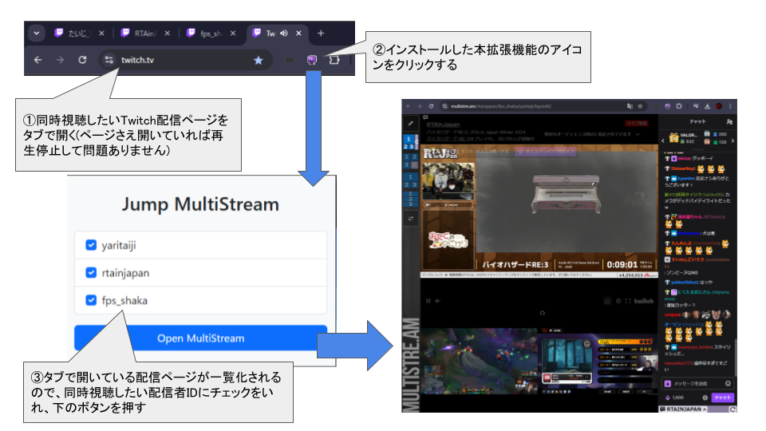

# JumpMultiStream

Twitchで視聴中の配信をマルチ表示するためのChrome拡張機能です。別タブで表示したいTwitch配信ページを開いてから拡張機能のアイコンをクリックすると利用できます。



この拡張機能を利用することで、今まではMultiStreamのページ上で配信IDをコピー＆ペーストしていた手間が省けます。

Twitch配信をマルチ表示するためのサイトは以下が対応しています。

- Multistre.am ( https://multistre.am/ )
- Twitch Theater ( https://twitchtheater.tv/ )
- MultiTwitch ( https://multitwitch.tv/ )
- Rare Drop Mult ( https://multi.raredrop.co/ )

## 使い方

以下の開発ガイドの通り、```chrome://extensions```からパッケージ化されていない拡張機能を読み込んでください。

https://developer.chrome.com/docs/extensions/get-started/tutorial/hello-world?hl=ja#load-unpacked

## 設定

ポップアップ画面の右上歯車ボタンから設定が可能です。

「Twitch配信をマルチ表示するためのサイト」「ユーザID除外リスト」が設定可能です。
